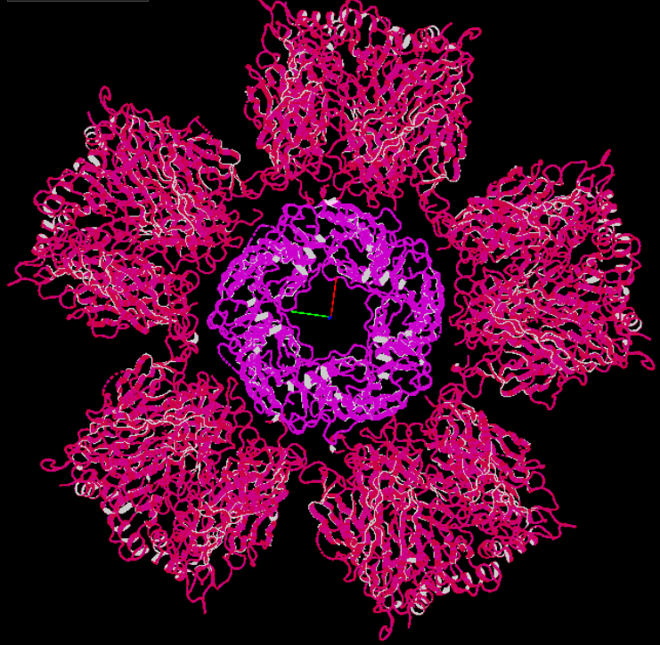
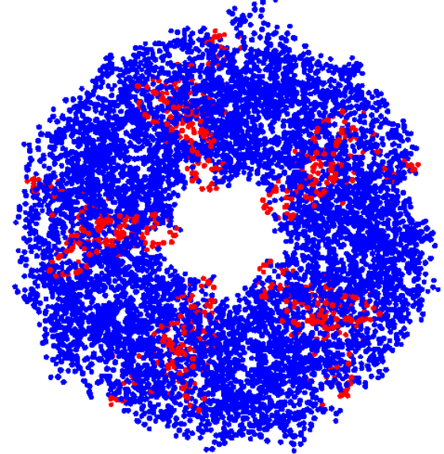
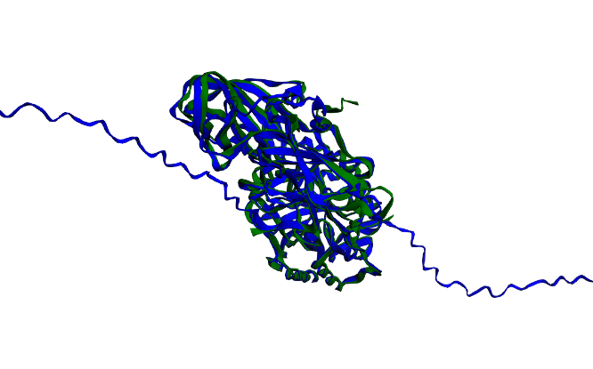
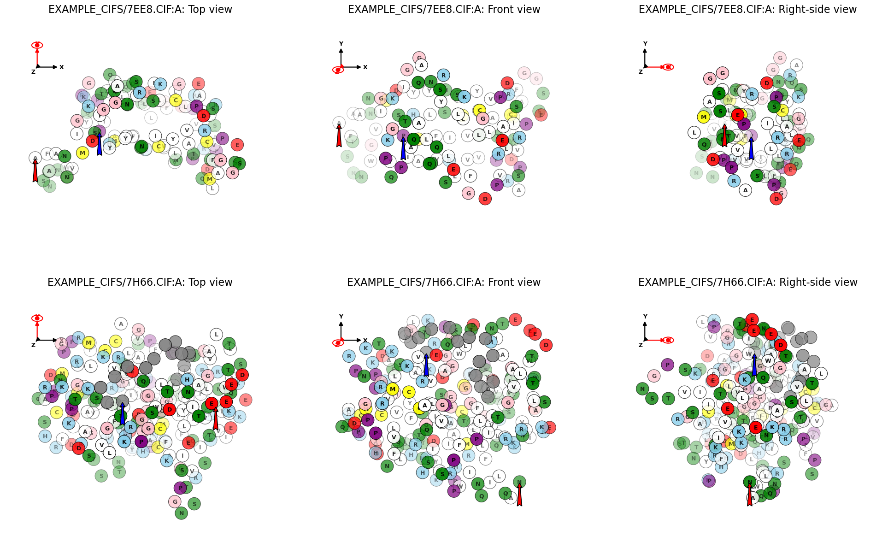

# Biotite & Atomworks Playground

This repository collects the structural and sequence function I commonly used with **Biotite** and **Atomworks**.
Each notebook focuses on a practical theme and reusable patterns.

---

## 1. Basic Structure Operations

**`20251209_biotite_structure_rotation_symmetry.ipynb`**

Core structural manipulation utilities:

* Load, clean, and parse structures
* Check residue ID continuity
* Check backbone continuity
* Detect duplicate atoms
* Rotations:

  * `rotate`
  * `rotate_centered`
  * `rotate_about_axis`
* `orient_principal_components`
* Radius of gyration (`gyration_radius`)
* Concatenate multiple structures into one

---

## 2. Distance Matrix & Interface Analysis

**`20251210_biotite_distance_matrix.ipynb`**

Annotation system and geometric analysis:

* Create new annotations

  * `set_annotation("chain_res", chain_res)`
  * `set_annotation("b_factor", b_factor)`
* Access annotations

  * `atom_array.b_factor`
* Distance matrix between chains
* Use `CellList` to:

  * Compute interface residues
  * Store interface info in `b_factor`

---

## 3. RMSD & Structural Superimposition

### Biotite-based workflow

**`20251220_rmsd_superimpose.ipynb`**

* `rmsd.FieldQuery`
* `rmsd.search`
* `afdb.fetch`
* `struc.to_sequence`
* Sequence alignment
* `struc.superimpose_homologs`
* `struc.rmsd`
* `py3dmol` visualization (embedded in Atomworks)

---

### Atomworks dataset-level superimposition

**`20260109_atomworks_superimpose.ipynb`**

* Atomworks `parse`
* `FileDataset`
* `id_to_idx`
* Dataset-level superimposition using Biotite
* `struc.mass_center`
* `py2dmol` visualization

---

## 4. Biotite Sequence Analysis

**`20260124_biotite_sequence.ipynb`**

Sequence retrieval, alignment, and visualization:

* `entrez.search`
* `entrez.fetch_single_file`
* `fasta.FastaFile.read`
* `seq.ProteinSequence`
* `uniprot.SimpleQuery`
* `uniprot.search`
* `uniprot.fetch`
* Substitution matrices
* `mafft.MafftApp.align(seqs)`
* `alignment.trace`
* `alignment.get_codes`
* `align.get_pairwise_sequence_identity`
* Visualization:

  * `graphics.plot_alignment_similarity_based`
  * `graphics.plot_alignment_type_based`
  * `graphics.plot_alignment_array`
  * `graphics.plot_sequence_logo`

---

## 5. CellList Deep Dive

**`20260131_biotite_CellList.ipynb`**

Focused exploration of `CellList`:

* Clash detection
* Efficient distance-based neighbor search
* CellList-based distance matrix computation

---

## 6. Atomworks Dataset & Metadata

**`20260201_atomworks_dataset_metadata.ipynb`**

Atomworks dataset follows a 3-stage pipeline:

1. **Dataset**
   Index → Raw example

2. **Loader**
   Raw example → Standardized dict
   Typically includes:

   * `atom_array`
   * `example_id`
   * `extra_info`

3. **Transform**
   Standardized dict → Model-ready dict

   * Cropping
   * Atomization
   * Encoding
   * Feature extraction

(Annotation and featurization are kept separate.)

This notebook explores:

* `FileDataset`
* Metadata loading
* Parquet creation

---

## 7. Binding Site–Based Clustering

**`20260201_enzyme_binding_cluster.ipynb`**

Using Biotite + Atomworks to perform clustering based on binding site geometry.

---

## 8. 2D Structural Image Reconstruction (Globular & Amyloid)

Inspired by:
[https://zenodo.org/records/4090925](https://zenodo.org/records/4090925)

Notebooks:

* `20260214_biotite_image_globule_project.ipynb`
* `20260214_biotite_image_globule.ipynb`
* `20260215_biotite_image_amyloid.ipynb`

Biotite is used to parse atomic structures and extract the geometric information needed for 2D projection and schematic rendering.

* **Amyloid filaments**
  Structural coordinates are parsed and flattened into a linear representation suitable for filament visualization.

  

* **Globular proteins**
  Secondary structure elements are mapped onto the sequence.

  * **Bold** residues indicate β-strands
  * Dashes (`-`) indicate α-helices

  

  An orthographic projection of the globular structure is generated, including support for multi-structure superimposition.
  The image output reflects the selected projection axis and camera orientation.

  
